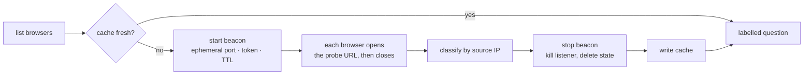

# chrome-pick

Know which Chrome is which before Claude touches it.


Claude sees your connected browsers like this:

```json
[{"deviceId":"e324d16a-...","name":"Browser 1","osPlatform":"macOS","isLocal":true},
 {"deviceId":"2175f1c8-...","name":"Browser 2","osPlatform":"macOS","isLocal":true}]
```

Names are ordinals. Both `isLocal: true`. If Chrome is open on your desktop *and* a work
laptop, "open this page" is a coin flip — and half the time it lands on the machine you
are screen-sharing.

chrome-pick makes every connected browser fetch one URL from a temporary local server,
then names each one by the source IP the request arrived from:

```text
Before                          After
1. Browser 1                    1. Browser 1 — this Mac (e324d16a)      [Recommended]
2. Browser 2                    2. Browser 2 — work laptop (2175f1c8)
                                   source 10.0.0.57 · work-mbp.lan · Windows
```

## Install

```sh
git clone https://github.com/jhammant/chrome-pick-skill.git
ln -s "$PWD/chrome-pick-skill/skill" ~/.claude/skills/chrome-pick
```

Needs macOS, [Claude Code](https://claude.com/claude-code) with the Chrome extension
connected, and `/usr/bin/python3`. No pip, no npm — stdlib only, pinned to the system
interpreter so a venv or asdf shim can't interfere.

Claude loads it next session. It fires at the start of any browser task, and on "wrong
browser", "which chrome", "that's my work laptop", or "re-probe".

## Labels

| Source IP | Label | Meaning |
|---|---|---|
| `127.0.0.1` or this Mac's own address | `this-mac` | The Chrome in front of you |
| Other RFC1918 | `same-lan` | Another machine on your network |
| `100.64.0.0/10` | `tailnet` | Reached you over Tailscale |
| Public | `remote` | Via NAT, a relay or a port forward |
| Nothing arrived | `unreachable` | Different network, or a VPN on that machine |

Labels are cached in `~/.claude/chrome-browsers.json`, so the usual run costs nothing —
no probe, just a labelled question. It re-probes only when a label could be wrong: an
unknown browser appears, or this Mac moved to another LAN where `10.0.0.57` no longer
means what it did yesterday. A browser going offline invalidates nothing.

## How it works



Four rules it will not break:

- **Never auto-selects.** Better labels make the browser question better, not optional.
- **Never invents a label.** A failed probe downgrades to `unreachable` and gets out of
  the way. It does not block the task.
- **Leaves nothing behind.** Beacon dies on its TTL, `stop` kills the listener and deletes
  its state, every tab it opens it closes. Pre-existing tabs are never touched.
- **A `selftest` pass is not proof of reachability.** Traffic from this Mac to its own LAN
  IP short-circuits internally and never crosses the wire. The tool says so itself rather
  than letting you conclude otherwise.

## If someone else sees the tab

A probed browser on another desk shows one page for a moment:

> **chrome-pick — this browser has been identified.** Claude Code opened this tab only to
> work out which machine this Chrome is running on, by looking at the network address the
> request came from. Nothing was read from this browser and nothing was sent anywhere.

The probe URL carries a deviceId and a random nonce. Nothing else. Wrong token gets a 403
and records no hit.

## Limits

- **macOS only** — shells out to `ifconfig`, `route`, `arp`.
- **Separates machines, not profiles.** Two Chromes on one Mac both answer from the same
  address and both read `this-mac`.
- **A firewall or full-tunnel VPN can make a real browser look `unreachable`.** Reported as
  a caveat, never a conclusion. [`reference/troubleshooting.md`](skill/reference/troubleshooting.md)
  covers twelve failure modes seen in practice — ProtonVPN's kill switch, macOS stealth
  mode, `navigate` silently upgrading `http://` to HTTPS.

## Tests

```sh
/usr/bin/python3 -m unittest discover -s test -v
```

Twelve end-to-end tests against the real scripts, under a temporary `HOME` so your own
cache is untouched. Full lifecycle (start → probe → classify → stop → port closed), 403 on
a bad token, cache invalidation rules, and a human-set label surviving every re-probe.

A genuinely remote browser can't be tested here — that needs a second machine.

## License

MIT
