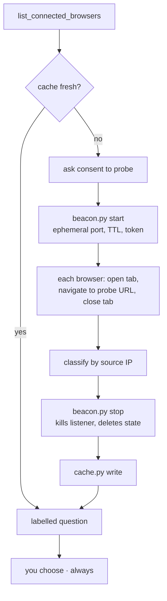

# chrome-pick

**Claude can see your Chrome browsers. It cannot tell them apart.**

```json
[{"deviceId":"e324d16a-...","name":"Browser 1","osPlatform":"macOS","isLocal":true},
 {"deviceId":"2175f1c8-...","name":"Browser 2","osPlatform":"macOS","isLocal":true}]
```

That is the whole of what `list_connected_browsers` returns. Same name shape, same OS,
both `isLocal: true` — the names are ordinals, not identities. If you have Chrome open on
your desktop *and* on a work laptop, both signed into the same Claude account, then
"open this page" is a coin flip. Ours landed wrong: the work laptop got navigated to a
home router's admin UI and hit a cert error, on someone else's screen.

`chrome-pick` gives each browser a name by finding out **where it is on the network**. It
stands up a short-lived HTTP beacon on this Mac, has every connected Chrome fetch one URL
from it, and reads the source IP of each request:

| Source IP | Label | Meaning |
|---|---|---|
| `127.0.0.1` or one of this Mac's own addresses | `this-mac` | The Chrome in front of you |
| Another RFC1918 address | `same-lan` | A different machine on your network |
| `100.64.0.0/10` | `tailnet` | Reached you over Tailscale |
| A public address | `remote` | Came via NAT, a relay or a port forward — named, not guessed |
| No request arrived | `unreachable` | Different network, or a VPN on that machine |

Then it hands those labels to the browser-choice question, so you pick from this:

```text
1. Browser 1 — this Mac (e324d16a)          [Recommended]
   e324d16a-c186-4ece-944c-42905e74c5df · hit the beacon from 127.0.0.1 · macOS
   · high confidence · just probed
2. Browser 2 — work laptop (2175f1c8)
   2175f1c8-b6f5-40af-8022-6ad894f689a2 · source 10.0.0.57 · work-mbp.lan
   · Windows · high confidence · just probed
3. Open a confirmation screen in every connected Chrome extension and let me select the right one there.
```

instead of this:

```text
1. Browser 1
2. Browser 2
```

## How it works



The cache lives at `~/.claude/chrome-browsers.json` and makes the common run free: no
probing, just a well-labelled question. It re-probes only when it must — an unknown
browser appears, the schema changes, or this Mac moves to a different LAN, where
`10.0.0.57` no longer means what it meant yesterday. A browser merely going *offline*
never invalidates anything; the other labels are still correct.

## Install

Requires macOS, [Claude Code](https://claude.com/claude-code) with the Claude-in-Chrome
extension connected, and `/usr/bin/python3`. No pip, no npm, no dependencies — the
scripts are stdlib-only and pinned to the system interpreter so an active venv or asdf
shim cannot interfere.

```sh
git clone https://github.com/jhammant/chrome-pick-skill.git
ln -s "$PWD/chrome-pick-skill/skill" ~/.claude/skills/chrome-pick
```

Claude picks it up on the next session. It fires at the start of any browser task, and
whenever you say "wrong browser", "which chrome", "that's my work laptop", or ask it to
re-probe.

## Design rules

These are load-bearing, and the skill states them to Claude as rules rather than hints:

- **It never auto-selects.** Better labels make the browser-choice question better, not
  optional. You always choose; the skill only makes the choice an informed one.
- **A failed probe never blocks the task and never invents a label.** It downgrades to
  `unreachable` at low confidence and gets out of the way.
- **It leaves nothing behind.** The beacon self-terminates on a TTL, `stop` kills the
  listener and deletes its state, and every tab it opens, it closes. Tabs that were
  already there are never touched.
- **A `selftest` pass is not proof of reachability.** Traffic from this Mac to its own LAN
  IP short-circuits internally and never crosses the wire. The scripts say so in their own
  output rather than letting you conclude otherwise.

## What the other person sees

If a probed browser is on someone else's desk, a tab opens for a moment showing:

> **chrome-pick — this browser has been identified**
> Claude Code opened this tab only to work out which machine this Chrome is running on, by
> looking at the network address the request came from. Nothing was read from this browser
> and nothing was sent anywhere. You can close this tab.

The probe URL carries a deviceId and a random ephemeral nonce. Nothing else. The beacon
is token-gated (a wrong token gets a 403 and records no hit), binds an ephemeral port,
and dies on its TTL.

## Limits

- **macOS only.** It shells out to `/sbin/ifconfig`, `/sbin/route` and `/usr/sbin/arp`.
- **It separates machines, not profiles.** Two Chrome installs on the *same* Mac both
  answer from the same address and both label `this-mac`.
- **A firewall or full-tunnel VPN can make a real browser look `unreachable`.** That is
  reported as a caveat, never as a conclusion. `reference/troubleshooting.md` covers the
  twelve failure modes we hit in practice, including ProtonVPN's kill switch, macOS
  stealth mode, and `navigate` silently upgrading a `http://` probe URL to HTTPS.

## Tests

```sh
/usr/bin/python3 -m unittest discover -s test -v
```

Twelve end-to-end tests. They run the real scripts under a temporary `HOME`, so your own
cache is never touched, and simulate a browser with `urllib` — the beacon classifies on
source IP alone, so a request from this machine is indistinguishable from Chrome's. They
cover the full lifecycle (start → probe → classify → stop → port closed), token
rejection, cache invalidation rules, and the fact that a human-set label survives every
re-probe.

What they cannot cover is a genuinely remote browser: that needs a second machine.

## License

MIT
